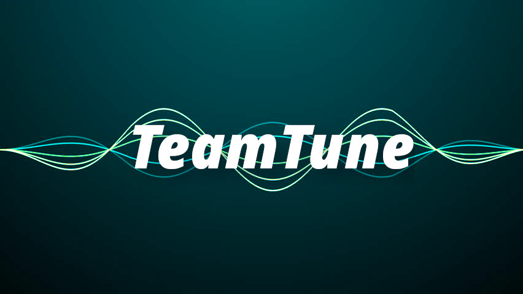

# TeamTune

[View on Youtube](https://youtu.be/_YL6bCYg2RQ)

### Team
* [Thomas Suarez](https://github.com/tomthecarrot)
* [Matt Kelsey](https://github.com/mattkelsey)
* [Cameron Bennett](https://github.com/mach33n)
* [Nicholas Grana](https://github.com/Nicholas714)

### Inspiration
We love playing BeatSaber, a virtual reality game that is rhythm based. But the game always left us wanting more, like the ability to create our own sounds, work with friends, and involve more movement into the cross-reality experience. TeamTune addresses all of these desires and more, in a visually stunning musical experience.

### What it does
Each player connects with their device (Android or iOS) to TeamTune and selects the instrument they would like to use. Then, movements in the real world adjust different properties of that instruments sounds. By moving in the real world, the synths play different notes, the drums change tempo, and the music comes to life. With four players connected, a cacophony of sounds is formed (and, if you're good, some nice sounding melodies).

### How we built it
We used the [Teleportal](https://teleportal.app), a geolocation-based AR toolkit that allows for the connection of multiple AR clients in one single world. We then used Audacity to sample instruments and incorporated our knowledge of music theory to make sliding scales for the synths that sounded pleasing to the ear, drum riffs, basslines, and more. We used Unity, which makes game development essentially drag and drop + some basic scripting, to make a visually pleasing environment for the music to be constructed in.

### Challenges we ran into
Unity merge conflicts are a nightmare. Getting audio samples that don't distort is challenging. Latency and music do not mix.

### Accomplishments that we're proud of
A relatively fully featured AR application that (mostly) works. We got more sleep than expected too!

### What we learned
Testing AR is hard in a space-constrained environment.

### What's next for TeamTune
We would love to keep developing out this application to include more instruments and customization, as well as make the environment interact with the music (pulsing particle systems, sound waves, etc).

### Built With
* Unity
* Teleportal
* Audacity
* Figure
